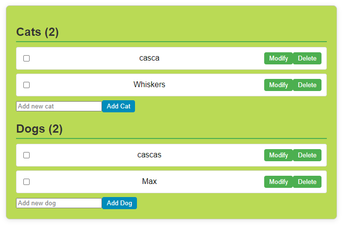

# Angular (20+) Forms: `Template Driven`, `React Driven Template` and `Signal Driven` 

## DEMO


---

## Template-Driven Form Component
```js
export class PetListComponent {
  items: Item[] = [...items];  // Direct array manipulation
  newItemName = '';

  addItem(): void {
    if (this.newItemName.trim()) {
      this.items.push({ name: this.newItemName.trim(), isChecked: false });
      this.newItemName = '';
    }
  }
}
```
Key characteristics:
- Uses [(ngModel)] for two-way binding
- Form state is managed directly in the component class
- Simpler to implement but less control over form state
- Changes are tracked through Angular's change detection
- Good for simple forms with basic validation


## Reactive Form Component
```js
export class PetListComponent implements OnInit {
  petForm: FormGroup;

  constructor(private fb: FormBuilder) {
    this.petForm = this.fb.group({
      items: this.fb.array([]),
      newItemName: ['', Validators.required]
    });
  }

  get itemsArray(): FormArray {
    return this.petForm.get('items') as FormArray;
  }
}
```

Key characteristics:
- Uses FormGroup, FormArray, and FormControl for form state management
- Form state is managed through reactive forms API
- More control over form state and validation
- Better for complex forms with dynamic fields
- Easier to test and maintain
- Form state is immutable and changes are tracked through form controls

reactive-driven forms
- ReactiveFormsModule is used instead of `FormsModule`
- FormBuilder is utilized to construct FormGroup and FormArray.
- FormArray holds the lists of cats and dogs, where each pet is a form group containing name and isChecked controls.
 The form controls are accessed dynamically using the index in the template.


## Signal-based Form Component
```js
export class PetListSignalComponent {
  items = signal<Item[]>([...items]);  // Using Angular's new signal API
  newItemName = '';

  addItem(): void {
    if (this.newItemName.trim()) {
      this.items.update(items => [...items, { name: this.newItemName.trim(), isChecked: false }]);
      this.newItemName = '';
    }
  }
}
```

## Key characteristics:
✅- Uses Angular's new signal() API for state management
✅- More modern approach to state management
✅- Better performance through fine-grained reactivity
✅- Simpler than reactive forms but more powerful than template-driven
✅- Changes are tracked through signals instead of change detection
✅- Good balance between simplicity and control
✅- Used `updateOn` for better Performance & UX

---

### :100: <i>Thanks!</i>
#### Now, don't be an stranger. Let's stay in touch!

<a href="https://github.com/leolanese" target="_blank" rel="noopener noreferrer">
  
</a>

##### :radio_button: Linkedin: <a href="https://www.linkedin.com/in/leolanese/" target="_blank">LeoLanese</a>
##### :radio_button: Twitter: <a href="https://twitter.com/LeoLanese" target="_blank">@LeoLanese</a>
##### :radio_button: DEV.to: <a href="https://www.dev.to/leolanese" target="_blank">Blog</a>
##### :radio_button: Questions / Suggestion / Recommendation: developer@leolanese.com
